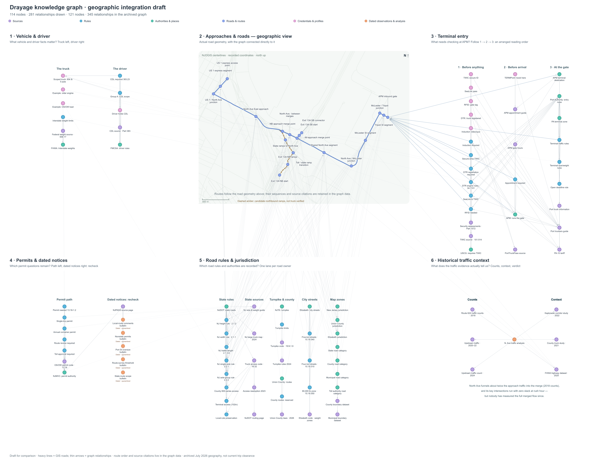

# Drayage knowledge graph

An evidence-backed knowledge graph for the last-mile truck approach to APM Terminals Elizabeth, New Jersey. It connects roads, terminal-entry requirements, authorities, source documents, vehicle profiles, and historical traffic findings. The repository includes the graph data, visualizations, Python implementation, a small checking service, and its tests.

## See the knowledge graph

[Open the full-resolution six-section PNG](prototype/knowledge_graph/output/integrated-geographic-draft/knowledge-graph-geographic-draft.png) to zoom into the labels.



This is the latest geographic presentation draft, preserved from September 7, 2026. It draws **114 nodes and 281 relationships** from the connected graph's **121 nodes and 345 relationships**. Seven route, approach, and source nodes are hidden in this view to reduce repetition; their records and relationships remain in the graph exports.

**Traffic-caption correction:** the draft's phrases “zero slack” and “nobody has measured” overstate the retained evidence. The 2018 counts show 29,973 vehicles/day at a station above the complete merge versus an upstream median of 15,460, about 1.94 times the volume. Selected lane groups at two intersections received LOS E ratings in the 2022 study, indicating substantial delay; that rating alone does not establish gridlock or zero spare capacity. The archive lacks a newer count at the comparison station and does not establish whether others have collected one. See the [retained traffic analysis](data/processed/traffic_analysis.json).

Read the six sections as follows:

1. **Vehicle and driver:** the scoped truck, separate example profiles, and driver-license requirements.
2. **Approaches and roads:** archived road geometry and the terminal gate. Dashed amber ramps are candidates whose truck suitability is unverified.
3. **Terminal entry:** credentials and induction, preparation before arrival, then gate-related requirements. This is an arranged reading order, not a quoted terminal procedure.
4. **Permits and dated notices:** permit requirements alongside time-sensitive observations that require rechecking.
5. **Road rules and jurisdiction:** rules grouped by the authorities responsible for them.
6. **Historical traffic context:** the count records and studies behind the corridor findings, subject to the correction above.

Heavy lines show roads; thin arrows show recorded graph relationships. An arrow does not necessarily indicate vehicle travel direction.

## Inspect the records

| Artifact | What it contains |
| --- | --- |
| [Connected graph JSON](prototype/knowledge_graph/output/evidence-graph/graph.json) | 121 nodes, 345 relationships, and attached evidence records |
| [GraphML export](prototype/knowledge_graph/output/evidence-graph/graph.graphml) | A portable graph export with nested records stored as JSON attributes |
| [Complete archive JSON](prototype/knowledge_graph/output/evidence-graph/graph-archive.json) | 122 records, including the unlinked 2020 facilities-map source |
| [Interactive graph](prototype/knowledge_graph/output/evidence-graph/index.html) | An earlier organized layout with zoom and record inspection; download the repo and open this file locally |
| [Neighborhood explorer](prototype/knowledge_graph/output/evidence-graph/explorer.html) | Search and inspect a record's immediate connections, opened locally |
| [Graph design](prototype/knowledge_graph/docs/design.md) | Node and relationship meanings, checking contract, and coverage boundaries |

GitHub displays HTML source rather than running these explorers. They work as local files after cloning or downloading the repository. The interactive layout differs from the latest geographic PNG.

## Run the graph and checking service

Use Python 3.11 with NetworkX 3.6.1. From the repository root, a fresh environment can be prepared with:

```sh
python3 -m venv .venv
source .venv/bin/activate
python3 -m pip install -r requirements.txt
python3 scripts/verify_evidence_snapshot.py
cd prototype/knowledge_graph
python3 -m unittest discover -s tests -v
python3 -m kg context summary
python3 -m kg context induction
python3 -m kg check --input examples/matching-induction.json
```

The evaluator implements **one synthetic APM safety-induction check**. It returns `met`, `not_met`, `unresolved`, or `not_applicable`, with citations, missing facts, and unchecked requirements. A `met` result does not establish terminal entry or dispatch clearance. Other retained clauses are graph evidence, not completed executable checks.

The read-only MCP tools are `check_apm_induction` and `get_drayage_graph_context`. The local stdio server runs with:

```sh
python3 run_mcp.py
```

For a consumer-app connector, use the absolute path to this clone's Python environment as the command and this clone's `prototype/knowledge_graph/run_mcp.py` as its argument. The original configuration example records the development machine's paths and must be adapted. No app configuration is changed by these commands.

Rebuild the JSON, GraphML, and interactive exports from the prototype directory:

```sh
python3 export_graph.py
```

The geographic SVG can be regenerated with `python3 tools/author_integrated_geographic_draft.py`. PNG rendering additionally requires `rsvg-convert`; it is not needed to run the service or tests. The saved PNGs are included for readers without rendering tools.

## Evidence and reproducibility

The 50 files under `data/` are copied unchanged from [last-mile-drayage-pilot at e59f230](https://github.com/itsnotmarvin/last-mile-drayage-pilot/tree/e59f230358a83cd06cb9f1926226f6029baaf7e8). [evidence-snapshot.json](evidence-snapshot.json) records the source commit and SHA-256 of each file. This fixed snapshot makes this repository self-contained; it does not automatically follow future changes in the evidence repository.

The Python prototype came from the previously uncommitted local work. Its checking code, frozen cases, and captured Claude results are preserved. The original directory structure keeps its relative evidence paths and recorded implementation hashes valid. Earlier development notes refer to the “parent repository”; here that means this repository's root. Historical notes about unpushed work describe the earlier development state.

The standalone copy passed **112 tests** on September 7, 2026. They cover evidence integrity, graph relationships, exports, geographic geometry, input boundaries, the MCP handshake, and saved provider-run integrity. The [Claude Desktop report](prototype/knowledge_graph/docs/claude-provider-results.md) preserves six captured calls, including two model scope-extraction failures. This publication does not claim a new consumer-app test.

The source repository's broader validator has a known missing `visuals/visual_manifest.json` failure. That tool and its unrelated visual dependencies are not part of this graph repository; this publication does not claim to repair or pass it.

This is a research prototype using archived public evidence and synthetic driver fixtures. Live policy verification, actual credentials, full route eligibility, and current gate conditions remain outside its operational coverage. Source-document reuse permissions remain with their respective publishers; inclusion here does not grant a blanket license over those documents.
